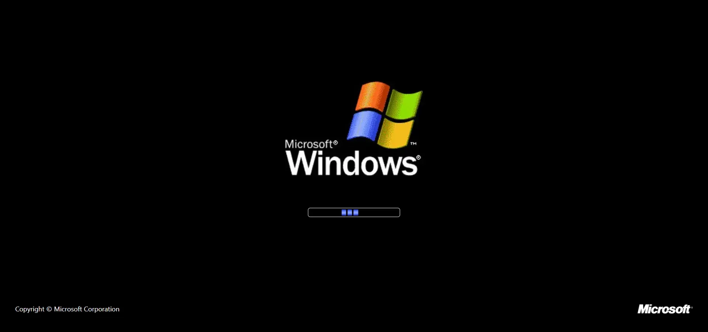
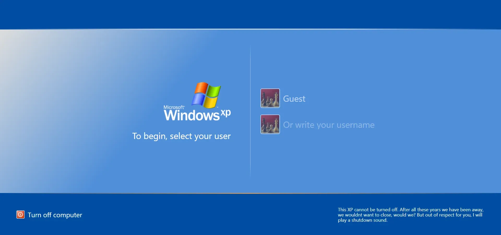
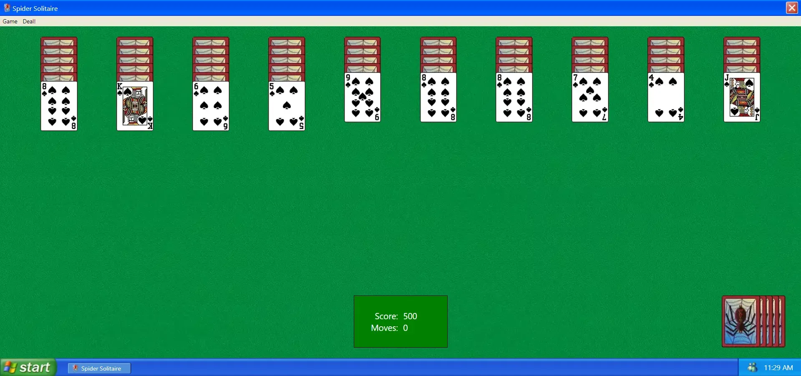
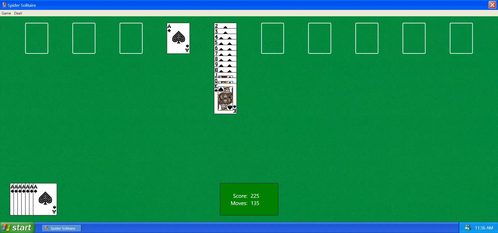
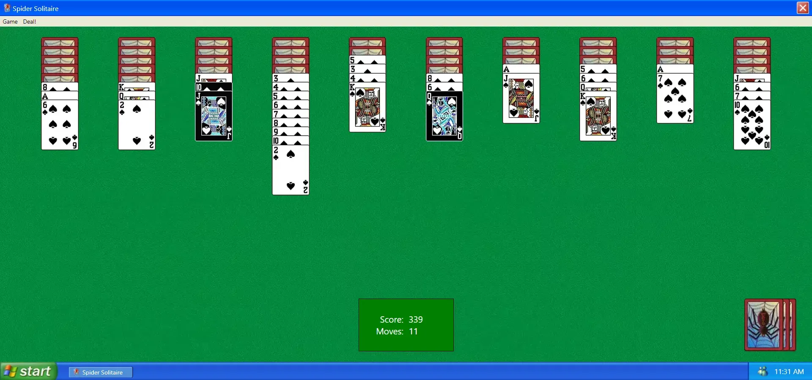
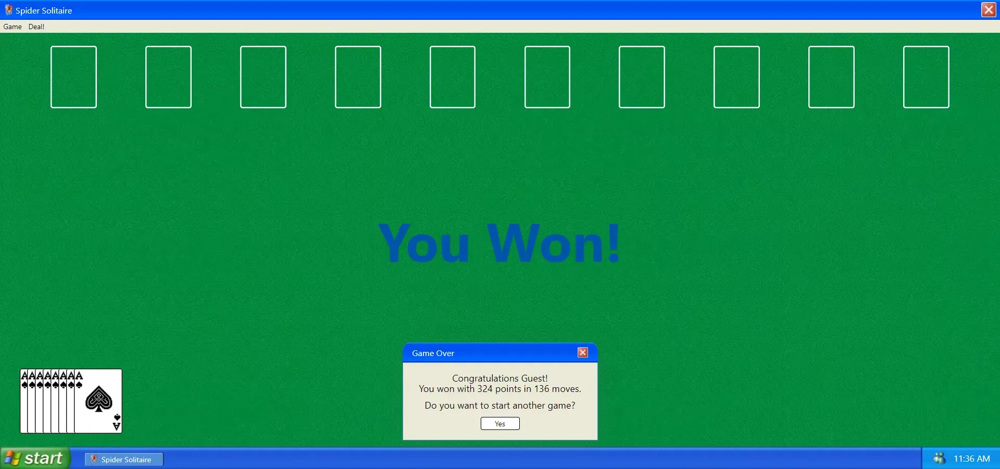

# Spider Solitaire

Legendary spider solitaire game with Windows XP theme! This project is the graduation project of Trendyol Frontend bootcamp. Flexible design is adopted. The game has been made using reusable components, following the principles of clean code. For tests, Jest (unit) and Cypress (e2e) were used. For automatic deployment, Github Actions and CI/CD were used.

## Live

[Github Page](https://enesbaspinar.me/spider-solitaire/) | [Heroku](https://legend-spider-solitaire.herokuapp.com/)

## Installation

You can download the project by cloning it from the Github site or by typing the following command:

```console
git clone https://github.com/baspinarenes/spider-solitaire
```

## Run Project

In the project directory you can run the following lines:

```console
npm install
npm start
```

## How To Play

- The goal of the game is to complete 8 decks of cards and not leave any cards on the board.
- The cards should be sorted from left to right as in the example (contrary to the real rules): [A, 2, 3, 4, 5, 6, 7, 8, 9, 10, J, Q, K]
- If there are no more moves to be played, the card must be dealt.
- If there is an empty column, no cards can be dealt.
- You can click on the green box to get suggestions.
- If all the cards are dealt and there are no more moves to be played, the new game can be started.

## Screenshots








